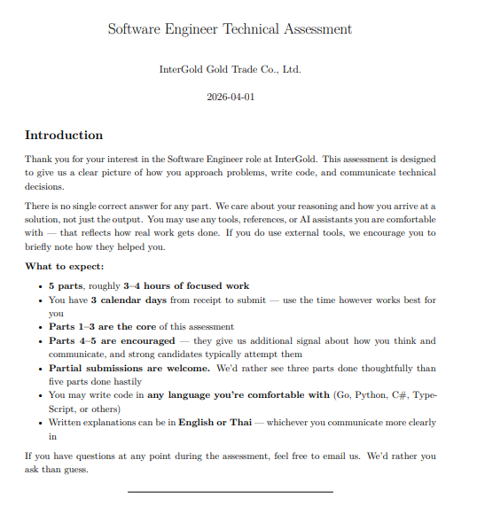

## Software Engineer Technical Assessment
**InterGold Gold Trade Co., Ltd.**  
**Date:** 2026-04-01

## Tools & Models Used

- **Tool:** Windsurf (Model: Minimax) , Z.ai (Model: GLM-4.7)
- **Git Code Review:** Gemini 2.5 Flash
- **Prompt:** analyze-and-suggest-improvements
- **Goal:** Find all flaws in the code and suggest improvements

## Test Answer Link 

- https://docs.google.com/document/d/1VhKaybw1qNSR8twahSByZmtfyg6WF6ceNabfXgMnP5s/edit?usp=sharing

## Test Note

- อ่านและสรุปความเข้าใจด้วยตนเอง แล้วใช้ AI เป็นตัวทดสอบว่าไม่หลุดประเด็นไหน
- อ่านโค้ดและ logic เบื้องต้น แล้วสรุปออกมาเป็นหัวข้อ จากนั้นให้ AI ช่วยชี้ว่ายังมีจุดไหนที่ขาดหายหรือควรเพิ่มเติม
- เขียน Specification ให้ชัดเจน และคิด test case ตามโจทย์ด้วยแนวทาง TDD แล้วให้ AI เขียนโค้ด จากนั้น review และปรับแก้ด้วยตนเองก่อน แล้วค่อย review ร่วมกับ AI อีกครั้ง